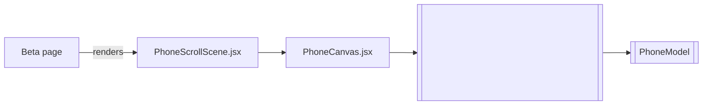
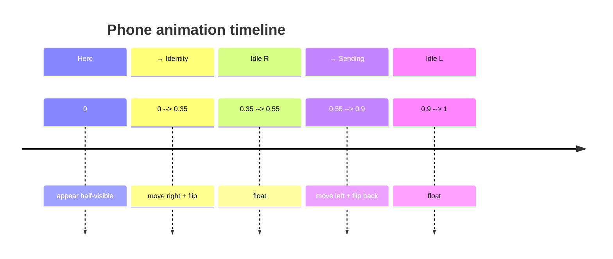

# Phone 3D Scroll-Animation Implementation Plan

## Goals

1. Render a single Three.js phone model once and position it above all DOM content.
2. In the hero section only the lower half of the phone is visible (scale ≈ 0.5).
3. While scrolling to the “Phone number is a user identity” section the phone:
   - scales down,
   - translates diagonally to the right,
   - rotates 180° around Y (horizontal flip).
4. While scrolling further to the “Send money … 3 clicks” section the phone:
   - flips back,
   - translates to the left,
   - keeps a reduced scale.
5. In its docked positions (identity and sending sections) it idles with a subtle floating motion.
6. Works on all screen sizes (no breakpoint condition).

## Component structure



### File map

| File                                                                                             | Purpose                                                                                      |
| ------------------------------------------------------------------------------------------------ | -------------------------------------------------------------------------------------------- |
| [`src/components/animation/PhoneCanvas.jsx`](src/components/animation/PhoneCanvas.jsx)           | Holds `<Canvas>` and `<PhoneModel />`.                                                       |
| [`src/components/animation/PhoneScrollScene.jsx`](src/components/animation/PhoneScrollScene.jsx) | Converts scroll progress into transforms and wraps `PhoneCanvas` in a framer-motion element. |
| [`src/styles/Beta.module.css`](src/styles/Beta.module.css)                                       | Adds `.phoneCanvasWrapper` with fixed positioning.                                           |
| [`src/app/beta/page.js`](src/app/beta/page.js)                                                   | Supplies section refs and mounts `PhoneScrollScene`.                                         |

## Scroll-progress keyframes

| Segment               | Scroll progress `P` | X (vw)   | Y (vh)  | Scale       | rotateY   |
| --------------------- | ------------------- | -------- | ------- | ----------- | --------- |
| Hero bottom (initial) | 0                   | 0        | 40      | 0.50        | 0°        |
| Slide + flip right    | 0 → 0.35            | 0 → 30   | 40 → 10 | 0.50 → 0.38 | 0° → 180° |
| Dock right (idle)     | 0.35 → 0.55         | 30       | 5       | 0.30        | 180°      |
| Slide + flip left     | 0.55 → 0.90         | 30 → -30 | 10      | 0.30 → 0.25 | 180° → 0° |
| Dock left (idle)      | 0.90 → 1            | -30      | 8       | 0.25        | 0°        |

### Mermaid timeline



## Implementation steps

1. **CSS:**  
   Add `.phoneCanvasWrapper` to `Beta.module.css`
   ```css
   .phoneCanvasWrapper {
     position: fixed;
     inset: 0;
     width: 100vw;
     height: 100vh;
     pointer-events: none;
     will-change: transform;
   }
   ```
2. **`PhoneCanvas.jsx`:** basic `<Canvas>` with `PhoneModel`.
3. **`PhoneScrollScene.jsx`:**
   - use `useScroll` targeting the last section to get total progress.
   - map progress to transforms with `useTransform`.
   - add floating spring when docked.
4. **`page.js`:** obtain `heroRef`, `identityRef`, `sendRef`; pass to `PhoneScrollScene`.
5. **Testing:** verify GPU performance, adjust keyframes.
6. **Future:** add `@media (min-width:1024px)` guard if needed.

## Dependencies

Already using `framer-motion` and `@react-three/fiber` so no new packages required.
